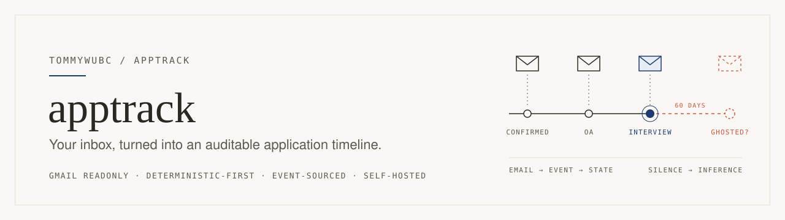
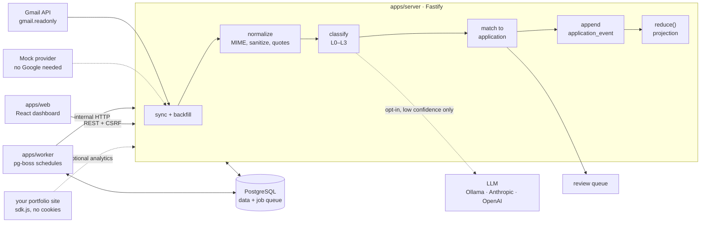
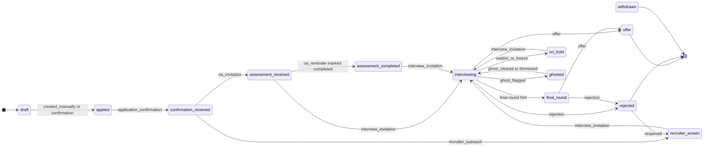
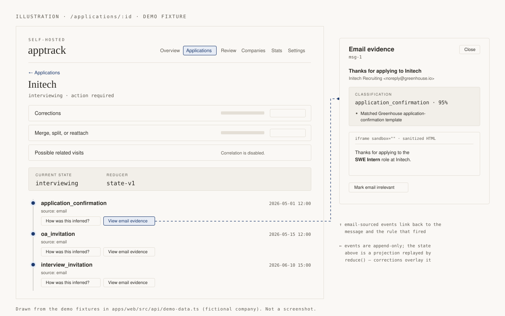

<picture>
  <source media="(prefers-color-scheme: dark)" srcset=".github/assets/banner-dark.svg">
  
</picture>

<p>
  <a href="https://github.com/TommyWuBC/apptrack/actions/workflows/ci.yml"></a>
  <a href="./LICENSE"></a>
  
</p>

**apptrack** is a self-hosted job application tracker that reads your own Gmail
(readonly), works out which emails are about job applications, and keeps an
event-sourced timeline for each application: confirmations, online
assessments, interviews, rejections, offers, and the ones that just go quiet.
Every inference has a confidence score and a piece of evidence you can click
through to. Your corrections always win. Automation never overwrites them.

It is a TypeScript monorepo: a Fastify API, a pg-boss worker, a React dashboard,
and PostgreSQL for both data and the job queue. The default classifier is
fully deterministic, so no email content leaves your machine unless you turn an
LLM mode on.

[Quickstart](#quickstart) · [How it works](#how-it-works) · [Lifecycle](#application-lifecycle) · [Privacy](#security-and-privacy) · [Docs](#documentation)

## Why this exists

When you apply at volume, a tracking spreadsheet falls behind fast. Greenhouse, Lever, Workday, Ashby, iCIMS and HackerRank all send their own
kind of email. And plenty of companies never write back at all. The facts are
already in your inbox. What's missing is something that reads them the same way
every time, shows you why it decided what it did, and doesn't send your mail to
a third party.

apptrack takes a few positions on this:

- **Deterministic first.** Header prefilter, ATS template detectors and keyword
  rules handle classification. An LLM (Ollama, Anthropic or OpenAI) is an
  opt-in fallback for low-confidence mail. In the default `deterministic` mode,
  nothing is sent to any AI provider.
- **Silence is an inference, not a fact.** "Ghosted" is flagged after a
  configurable quiet period (90 days by default, 60 for interviewing, 45 for a
  final round). It is labelled as a guess, pauses while an interview or OA
  deadline is in the future, and can be dismissed with one click.
- **Auditable.** Applications are a projection over an append-only event log.
  You can replay the log, see which email and which rule produced each event,
  and correct or lock any field.
- **Yours.** It's self-hosted for one owner. There's no telemetry and no shared
  cloud. OAuth tokens are encrypted with AES-256-GCM, and the optional analytics
  pipeline never persists a visitor IP.

## How it works



Each stage has a natural key and is idempotent. Reprocessing reads the stored
normalized text again and only appends replacement events when the
classification actually changes.

**Classification.** `L0` looks at headers only and decides whether to fetch the
body at all. Known ATS and assessment domains always get fetched. Bulk
newsletters with `List-Id` and `List-Unsubscribe` get skipped. `L1` matches
ATS platforms and subject templates, and `L2` runs keyword rule families with
anti-patterns. `L3` is the optional LLM extractor. It only runs when the
deterministic confidence is below 0.75 or the extraction is incomplete. It sees at most 4,000 characters of stripped text wrapped in
`<untrusted_email>`, has no tools, and its output is schema-validated against an
allowlist. Prompt-injection canary fixtures have to classify as `unknown`.
There are 17 event types in total. See [docs/classification.md](./docs/classification.md).

**Matching.** A classified email is scored against your open applications using
weighted signals. Same thread is worth 0.95, requisition ID or job URL 0.9,
recruiter address 0.5, role-title similarity 0.4, and so on. It auto-attaches
only when the score is at least 0.75 **and** beats the runner-up by 0.2.
Anything ambiguous goes to the review queue rather than being guessed. Fuzzy
company matches suggest a merge; they never merge silently. See
[docs/application-matching.md](./docs/application-matching.md).

**Timeline.** `application_events` is append-only. A pure reducer sorts events by
`(occurred_at, ingested_at, id)` and replays them into `applications.current_state`.
Late or backfilled mail is just another insert followed by a recompute. User
corrections are overlaid after the machine reduction, so they survive
reprocessing. See [docs/application-timeline.md](./docs/application-timeline.md).

**Schedules** (pg-boss, UTC): sync every 10 minutes, analytics aggregation every
5, ghost evaluation daily at 06:00, retention cleanup daily at 04:00.

## Application lifecycle

The common paths through the reducer (`state-v1`, in
[`packages/core/src/statemachine/reduce.ts`](./packages/core/src/statemachine/reduce.ts)):



The diagram leaves some things out on purpose, to stay readable:

- The reducer doesn't gate transitions. `rejection`, `withdrawal_confirmation`
  and `waitlist_or_freeze` can arrive at any stage, and `manual_override` can set
  any state.
- `offer`, `rejected` and `withdrawn` are terminal but can be reopened. An OA,
  recruiter, interview or offer event arriving after one of them sets
  `flags.reopened`.
- `interview_cancelled` pops back to the previous stage. A rejection and an
  interview or offer on the same UTC day are both kept and flagged as a
  conflict for review.
- `ghosted` is only reached through `ghost_flagged`, never from a terminal state.
  `stale` (45 days by default) is recorded as a status but doesn't change the
  state. Thresholds can be overridden per stage, per application type and per
  company. See [docs/ghosting.md](./docs/ghosting.md).

## See it

<picture>
  <source media="(prefers-color-scheme: dark)" srcset=".github/assets/timeline-sketch-dark.svg">
  
</picture>

<sub>An illustration, not a screenshot. It is drawn from the demo fixtures in
<code>apps/web/src/api/demo-data.ts</code> and follows the layout of
<code>ApplicationDetailPage.tsx</code>, <code>TimelineView.tsx</code> and
<code>EvidenceViewer.tsx</code>. In the real UI the evidence viewer opens as a
modal.</sub>

The dashboard has six views. **Overview** shows the pipeline board, what needs
action, and recent changes. **Applications** is a table you can search, filter
and sort, with a timeline and evidence page for each application. **Review**
holds uncertain classifications, ambiguous matches, merge suggestions, ghost
confirmations and same-day conflicts. **Companies**, **Stats** (small-sample
guard: n < 10 shows `n/N`), and **Settings** cover the rest. To try it without
Postgres or Google, open the SPA with `?demo=1`.

## Quickstart

You need Node 22, pnpm 9, and Docker for Postgres.

```bash
cp .env.example .env
# required: APP_ENCRYPTION_KEY, SESSION_SECRET, INTERNAL_JOB_SECRET
# generate: openssl rand -base64 32
pnpm install
pnpm migrate
pnpm demo    # synthetic owner + applications (no Google account needed)
pnpm dev
```

- Dashboard: http://localhost:5173 (the first visit goes to `/setup` if you didn't seed the demo)
- API: http://localhost:3000/healthz · readiness at `/readyz` (checks the DB and pg-boss)
- Mailpit UI: http://localhost:8025
- `pnpm dev` starts Docker Postgres and Mailpit, then the server, worker and Vite. It
  does **not** migrate or seed for you, so run those once first.
- `.env.example` defaults to `EMAIL_PROVIDER=mock` and `CLASSIFIER_MODE=deterministic`,
  so you can run the whole thing without a Google account. To connect real Gmail,
  see [docs/gmail-oauth.md](./docs/gmail-oauth.md).

### Self-host with Docker Compose

```bash
cp .env.example .env   # fill secrets; set NODE_ENV=production for HSTS
docker compose up -d --build
# the server entrypoint runs migrations automatically
```

Open http://localhost:3000 for the API (it also serves the built SPA when that's
configured). The worker reaches the server at `APP_BASE_URL=http://apptrack-server:3000`.
The compose file runs `postgres:16-alpine`, `apptrack-server` and `apptrack-worker`.
For operations, see [docs/setup.md](./docs/setup.md). Encrypted backups use
[`scripts/backup.sh`](./scripts/backup.sh) and
[`scripts/restore.sh`](./scripts/restore.sh), both built on `age`.

### Configuration you'll actually touch

| Variable | Default | What it does |
| --- | --- | --- |
| `EMAIL_PROVIDER` | `mock` | `mock` runs the fixture corpus; set up Gmail OAuth for real mail |
| `CLASSIFIER_MODE` | `deterministic` | `hybrid`, `api`, or `local` (Ollama) add the L3 LLM layer |
| `GOOGLE_CLIENT_ID` / `GOOGLE_CLIENT_SECRET` | empty | your own Google Cloud OAuth client, needed for real Gmail |
| `GEOLITE2_DB_PATH` | empty | local MaxMind GeoLite2 file for coarse analytics geo; no lookup leaves the box |
| `CORRELATION_ENABLED` | `false` | visit ↔ application scoring; only useful with analytics set up |
| `JOBS_MODE` | `boss` | `http` falls back to the older interval pollers |

The full list with comments is in [`.env.example`](./.env.example).

### Admin CLI

`apps/cli` provides a binary called `apptrack` with these commands: `user:create`,
`sync:run`, `backfill`, `reprocess`, and `export`. Export writes a privacy-safe
JSON dump.

## Optional: portfolio analytics and correlation

If you have a personal site, you can embed `/sdk.js`. It is dependency-free, and
the build fails if it reaches 2 KB gzipped. It sends page views and a small
allowlist of events (project view, résumé view or download, GitHub or contact
click) to **your** instance. It sets no cookies, keeps no localStorage
identifiers and does no fingerprinting. The server computes a daily-rotating
visitor hash and an optional GeoLite2 lookup in memory, then drops the IP.
[`examples/website-astro`](./examples/website-astro) is a working Astro example
with Playwright tests.

Correlation (`corr-v1`, off by default) then estimates whether an anonymous
session might relate to an application. It looks at timing around pipeline
events, a geo match with the company's office, LinkedIn or ATS referrers, and
résumé views. Probabilistic scores are **capped at "medium"**. "High" requires
the visitor to have used a unique per-application `?src=` link or a tracked
résumé URL that you minted. Tests keep phrases like "recruiter viewed" or
"visited by" out of every explanation. See
[docs/correlation-model.md](./docs/correlation-model.md).

## Classifier eval

These numbers come from `pnpm eval` over the synthetic golden set in
[`fixtures/golden/baseline.json`](./fixtures/golden/baseline.json) (classifier
`clf-2026.07.2`, n = 69 `.eml` fixtures covering Greenhouse, Lever, Ashby,
iCIMS, SmartRecruiters and Workday, plus edge cases such as base64 bodies,
ISO-8859-1, RTL text, calendar invites and prompt-injection canaries):

| Metric | Value |
| --- | --- |
| Overall F1 | **0.972** |
| Precision | 0.985 |
| Recall | 0.986 |

These fixtures are synthetic ATS-style emails, not a personal mailbox, so expect
lower recall on real mail. That's what the review queue is for. CI fails if the
F1 for any event type drops more than 2 points below this baseline.

## Repository layout

```text
apptrack/
├── apps/
│   ├── server/          Fastify API: auth, Gmail OAuth, pipeline routes, analytics ingest, /sdk.js
│   ├── worker/          pg-boss consumers + UTC schedules (sync, ghost, aggregate, retention)
│   ├── web/             React + TanStack Router/Query dashboard, demo mode, Playwright smoke
│   └── cli/             `apptrack` admin CLI
├── packages/
│   ├── core/            pure logic: normalize, classify, match, reduce, ghosting, correlation, crypto
│   ├── db/              Drizzle schema, migrations (0000–0004), repositories; the only place SQL lives
│   ├── providers/       EmailProvider contract: Gmail adapter + mock provider
│   ├── shared/          zod schemas and enums shared by every app (the API contract)
│   └── analytics-sdk/   browser tracker, size-gated under 2 KB gzip
├── examples/website-astro/   sample portfolio site wired to the SDK
├── fixtures/
│   ├── emails/          69 synthetic .eml + expected.json pairs, by ATS and edge case
│   └── golden/          eval index + committed baseline metrics
├── scripts/             dev runner, seed/demo, eval, fixture generator, backup/restore
├── docs/                per-subsystem docs + 13 ADRs (docs/adr/)
├── ARCHITECTURE.md      human walkthrough of the system
├── THREAT_MODEL.md      T1–T14 threats, mitigations, and how each is tested
├── PRIVACY.md           what is stored, what leaves the server, visitor disclosure
├── AGENTS.md            the full design blueprint (invariants, contracts, milestones)
└── DEVLOG.md · HANDOFF.md · PROGRESS.md   build log and agent relay notes
```

`pnpm boundaries` (dependency-cruiser) enforces the dependency direction. The
web app only depends on `shared` and talks REST. `core` stays pure. SQL stays in
`db`, and provider SDKs stay in `providers`.

## Security and privacy

- Passwords are hashed with Argon2id. Only SHA-256 hashes of session tokens are
  stored. Cookies are `httpOnly` and `SameSite=Lax`, and every mutation needs a
  session-bound CSRF token.
- Gmail access uses OAuth with PKCE and the `gmail.readonly` scope. Tokens are
  encrypted with AES-256-GCM, never returned by the API, and left out of exports.
- Email HTML is sanitized and rendered in a `sandbox=""` iframe. The app never
  fetches URLs it finds in email or analytics data.
- CSP with `frame-ancestors 'none'`, `X-Frame-Options: DENY` and `nosniff` are
  sent on every response, plus HSTS in production. Pino log redaction keeps
  tokens and email bodies out of the logs.
- Visitor IPs from analytics are never persisted: not in the database, not in
  logs, not in files.

Before exposing an instance, read [PRIVACY.md](./PRIVACY.md) for exactly what is
stored and what leaves your server in each classifier mode, and
[THREAT_MODEL.md](./THREAT_MODEL.md) for the threat list. Report
vulnerabilities privately; see [SECURITY.md](./SECURITY.md). Don't open public
issues containing secrets or exploit PoCs against live instances.

## Status and limits

v1.0.0 covers the whole planned scope: Gmail OAuth with incremental sync and
backfill, the mock provider, deterministic plus optional LLM classification,
matching, the timeline, corrections and review, ghosting, the dashboard and
stats, analytics ingest with the SDK and example site, opt-in correlation,
security hardening, encrypted backups, Dependabot, and releases to GHCR.

The honest caveats:

- It is built for **one owner per instance**. Multi-user support is designed for
  but not implemented.
- The eval numbers above are on synthetic fixtures. Long-running dogfooding
  against a live Gmail inbox is still listed as an owner follow-up in the
  acceptance checklist.
- Sync still runs normalize, classify and match inline. Moving that hand-off
  into separate queue jobs needs a decision on staging raw MIME, which is
  written up in [ARCHITECTURE.md](./ARCHITECTURE.md).
- Only Gmail is supported. Outlook, IMAP and `.eml` import sit behind the
  `EmailProvider` interface but aren't implemented yet.

**Versioning.** A breaking DB, API or config change bumps the major version,
features bump the minor, and fixes bump the patch. From 1.0.0 on, the public
REST and schema contracts only change additively. See
[CHANGELOG.md](./CHANGELOG.md).

## Documentation

| Doc | Topic |
| --- | --- |
| [ARCHITECTURE.md](./ARCHITECTURE.md) · [AGENTS.md](./AGENTS.md) | System walkthrough; the full design blueprint with invariants and contracts |
| [docs/setup.md](./docs/setup.md) | Install, auth, jobs, database, backups, security headers |
| [docs/gmail-oauth.md](./docs/gmail-oauth.md) · [docs/gmail-sync.md](./docs/gmail-sync.md) | Google Cloud OAuth client, sync and backfill |
| [docs/email-normalization.md](./docs/email-normalization.md) | MIME parsing, sanitization, quote stripping, calendar invites |
| [docs/classification.md](./docs/classification.md) | L0–L3 pipeline, modes, prompt-injection handling, eval |
| [docs/application-matching.md](./docs/application-matching.md) | Signals, weights, thresholds, company resolution |
| [docs/application-timeline.md](./docs/application-timeline.md) | Event sourcing and the reducer |
| [docs/corrections-review.md](./docs/corrections-review.md) | Corrections, locks, merge/split/reattach, review queue |
| [docs/ghosting.md](./docs/ghosting.md) | Ghost thresholds and semantics |
| [docs/dashboard.md](./docs/dashboard.md) | SPA routes and demo mode |
| [docs/analytics-integration.md](./docs/analytics-integration.md) · [docs/correlation-model.md](./docs/correlation-model.md) | SDK, ingest, visit ↔ application scoring |
| [docs/data-retention.md](./docs/data-retention.md) | What is kept and for how long |
| [docs/adr/](./docs/adr/) | Architecture decision records 0001–0013 |
| [docs/interview-preparation.md](./docs/interview-preparation.md) | Design Q&A: why PKCE, why event sourcing, and more |
| [docs/demo-storyboard.md](./docs/demo-storyboard.md) · [docs/v1-acceptance.md](./docs/v1-acceptance.md) | Recording a demo; the v1 acceptance checklist |
| [CHANGELOG.md](./CHANGELOG.md) · [CONTRIBUTING.md](./CONTRIBUTING.md) · [CODE_OF_CONDUCT.md](./CODE_OF_CONDUCT.md) | History, contributor setup (`EMAIL_PROVIDER=mock`), conduct |

## License

[MIT](./LICENSE). Built by [Tommy Wu](https://tommywubc.github.io).
